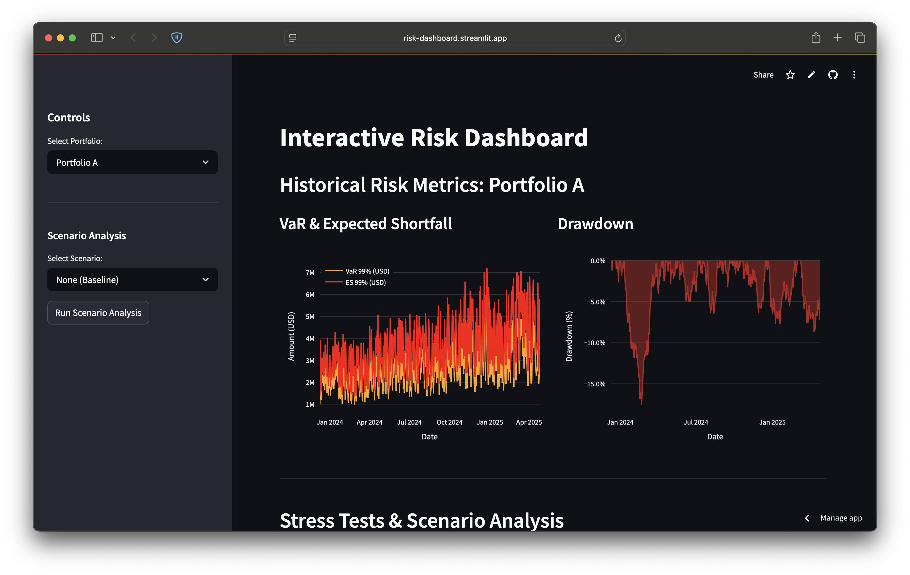

# Interactive Risk Dashboard (Streamlit + Plotly)

## Description

This web application provides an interactive dashboard for visualizing key portfolio risk metrics relevant to a hedge fund environment. Built using Streamlit and Plotly, it allows users to:

*   Monitor historical risk measures like Value-at-Risk (VaR), Expected Shortfall (ES), and Drawdowns.
*   Perform stress tests and scenario analysis by selecting predefined events or defining custom market shocks.
*   Visualize the potential P&L impact of scenarios across the portfolio and individual positions.

The primary goal is to enhance risk oversight, provide a deeper understanding of portfolio vulnerabilities, and serve as an intuitive communication tool for risk discussions.

**Note:** This application currently uses **simulated data and a highly simplified risk calculation model**. It serves as a template and **must be configured** with real data sources and a proper risk engine before practical use.

## Key Features

*   **Portfolio Selection:** Choose from available portfolios (currently simulated).
*   **Historical Risk Visualization:**
    *   Interactive line chart showing historical VaR (99%) and ES (99%) over time.
    *   Interactive area chart displaying historical portfolio drawdowns.
*   **Scenario Analysis:**
    *   Select from predefined market stress scenarios (e.g., Market Crash, Rates Shock).
    *   Define custom scenarios by inputting shocks for key factors (e.g., S&P 500 %, Rates bps, Oil %).
    *   Button to trigger scenario calculation based on current selections.
*   **Scenario Results Visualization:**
    *   Histogram showing the distribution of simulated P&L impacts across positions for the selected scenario.
    *   Scatter plot visualizing the P&L impact vs. market value for each position, colored by asset class.
    *   Summary table breaking down the total scenario P&L by asset class.
    *   Display of total portfolio P&L impact for the scenario.

## Technology Stack

*   **Python:** Core programming language.
*   **Streamlit:** Web application framework for building the UI and handling interactions.
*   **Plotly:** Library for creating interactive charts and visualizations.
*   **Pandas:** Data manipulation and analysis.
*   **NumPy:** Numerical operations.

## Prerequisites

*   Python (version 3.7+ recommended)
*   pip (Python package installer)

## Installation

1.  **Clone the repository or download the source code.**
2.  **Navigate to the project directory** in your terminal.
3.  **Install the required Python packages:**
    '''bash
    pip install streamlit pandas numpy plotly
    '''

## Configuration (Mandatory Steps)

Before this dashboard can provide meaningful insights, you **must** replace the placeholder functions with your actual data loading and risk calculation logic within the Python script (e.g., `risk_dashboard_st.py`).

1.  **Connect to Position Data:**
    *   Locate the `generate_dummy_positions(portfolio_name)` function.
    *   Replace its contents with code to fetch real position data (ticker, asset class, market value, relevant factor sensitivities like Beta, Duration, Deltas, etc.) for the given `portfolio_name`. Ensure it returns a Pandas DataFrame with the required columns.

2.  **Connect to Historical Risk Data:**
    *   Locate the `generate_dummy_risk_history(portfolio_name)` function.
    *   Replace its contents with code to fetch actual historical NAV, VaR, ES, and drawdown data for the given `portfolio_name`. Ensure it returns a Pandas DataFrame with columns like 'Date', 'NAV', 'VaR_99_USD', 'ES_99_USD', 'Drawdown_Pct'. Consider keeping the `@st.cache_data` decorator for performance if data loading is slow.

3.  **Integrate Your Risk Engine/Model:**
    *   Locate the `simulate_scenario_pnl(positions_df, spx_shock, rates_shock_bps, oil_shock)` function.
    *   **This is the most critical part.** Replace the highly simplified linear factor model with calls to your sophisticated risk engine or calculation library.
    *   Pass the `positions_df` and the scenario shock parameters (`spx_shock`, `rates_shock_bps`, `oil_shock`, *add any other factors you need*) to your engine.
    *   Your logic should calculate the estimated P&L impact for each position under the given scenario.
    *   Ensure the function modifies the input `positions_df` or returns a new DataFrame that includes a column named `ScenarioPnL` containing the calculated P&L for each position.
    *   Update the function arguments and the `PREDEFINED_SCENARIOS` dictionary if your risk model uses different factors or requires different input formats.

## Running the Application

1.  **Navigate to the project directory** in your terminal.
2.  **Run the Streamlit application:**
    '''bash
    streamlit run app.py
    '''
3.  Streamlit will provide a local URL (usually `http://localhost:8501`) in the terminal. Open this URL in your web browser.

## Usage

1.  **Select Portfolio:** Use the dropdown menu in the sidebar to choose the portfolio you want to analyze. The historical charts will update automatically.
2.  **Choose Scenario:**
    *   Use the "Select Scenario" dropdown in the sidebar.
    *   Choose a predefined scenario.
    *   Or, select "Custom" and enter your desired shock values (in % or bps as indicated) in the input fields that appear.
3.  **Run Analysis:** Click the "Run Scenario Analysis" button in the sidebar.
4.  **View Results:** The main panel will update to show:
    *   The total P&L impact for the portfolio under the selected scenario.
    *   A histogram of P&L impacts across individual positions.
    *   A scatter plot showing P&L vs. Market Value for each position.
    *   A summary table of P&L impact by asset class.

## Important Considerations

*   **Data Accuracy:** The quality and relevance of the dashboard depend entirely on the accuracy and timeliness of the underlying position data, historical risk data, and the sophistication of the integrated risk engine. The dummy data provided is **for illustration only**.
*   **Risk Model:** The scenario P&L calculation (`simulate_scenario_pnl`) **must be replaced** with a validated risk model appropriate for your fund's strategies and instruments. The placeholder implementation is grossly simplified.
*   **Security:** When deploying in a real hedge fund environment, ensure robust **authentication and authorization** mechanisms are implemented to control access to sensitive portfolio data. This template does not include any security features. Consider frameworks or techniques appropriate for your internal infrastructure.
*   **Performance:** For large portfolios or complex calculations, optimize data loading and risk engine calls. Streamlit's caching (`@st.cache_data`) can help for functions that don't need frequent recalculation.

## License

This project template is provided as-is. You are free to use, modify, and distribute it internally. No warranty is expressed or implied. Please ensure compliance with your organization's policies regarding software development and data handling.